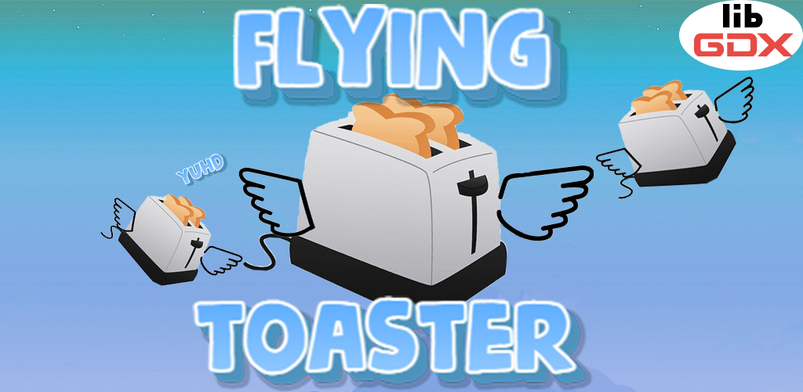
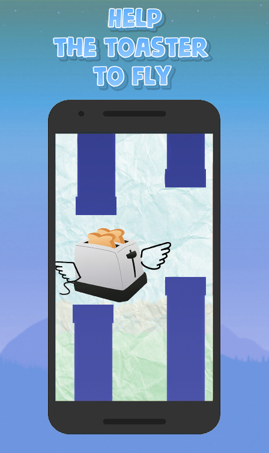
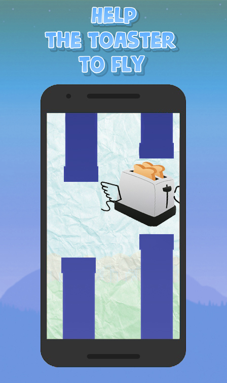
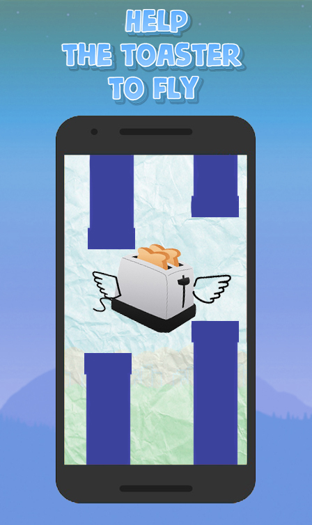

<h1 align="center"> Flying Toaster
 - This is a mobile arcade game made on the libGDX game engine in Java in IDE Android Studio</h1>

## Description

This mobile application is published in Google Play Market and is available for download at the link. <a href="https://play.google.com/store/apps/details?id=com.anatoliyvinokurov.flyingtoaster">link on Google Play Market</a>
<a href="https://play.google.com/store/apps/dev?id=7939525547152270598">My developer page in Google Play Market</a>

Flying Toaster is a simple game in which the player controls a toaster by tapping the screen to make it fly and avoid obstacles. The goal is to score as many points as possible by successfully overcoming as many obstacles as possible.

The game is set in a 2D world, where the toaster is constantly flying on wings to stay afloat. The player must carefully calculate his clicks to keep the toaster in the air and avoid obstacles such as pipes or poles. The game has simple retro graphics that give it charm and nostalgia.

As the game progresses, it becomes increasingly difficult for the player to overcome obstacles, making the game more challenging. The game also has power-ups and bonuses that the player can collect to increase his score and help him advance further.

The gameplay of Flying Toaster is simple, but it requires quick reflexes and good timing to succeed. The game has become a cultural phenomenon, with millions of people around the world playing it and trying to break records.

### Pictures

## Project setup

import this project to Android Studio

## Future scope

- Add translations to other languages.